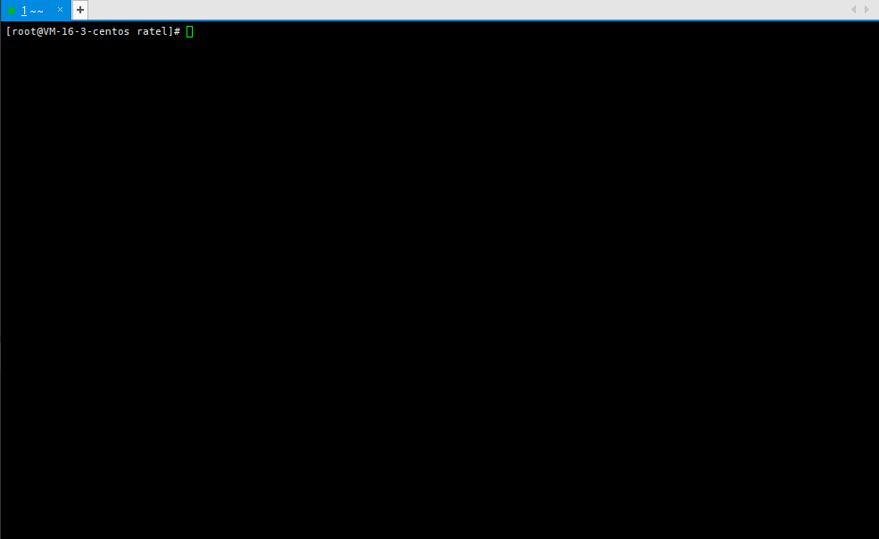

# server

[](https://pkg.go.dev/github.com/ratel-online/server)

The server for Ratel

## 运行
```bash
go run main.go -w 9999 -t 9998
```
- `w` Websocket 端口(可省略,默认9998)
- `t` TCP       端口(可省略,默认9999)

## 指令
- `s`：开始游戏
- `v`：刷新可用房间列表/查看房间成员/查看其它玩家游戏状态
- `e`：退出/返回
- `y`：确定
- `f`：取消
- `p`：不出
 
## 设置
房间属性设置：
- `set ds on`： 开启不洗牌模式
- `set ds off`： 关闭不洗牌模式
- `set sk on`： 开启技能模式
- `set sk off`： 关闭技能模式

## 技能
开启技能模式以后，玩家会随机被分配以下技能中的一个，主回合触发：
- **我要色色**：其余玩家沉迷其中，趁机偷掉了他们的最牛的牌
- **火眼金睛**：看穿对手的手牌
- **改换家门**：手牌重新分配
- **破斧沉舟**：只留下5张最强的牌
- **大幻想家**：最小的一张牌变成了癞子
- **两极反转**： 随机与一名玩家调换手牌
- **追亡逐北**：主回合，多获得一次出牌机会
- **时空裂缝**：其余玩家出牌时间减半
- **996**：所有对手强制获得9,9,6三张牌
- **添砖加瓦**：从弃牌池中随机抽取两张牌返还给所有对手

## 规则
### 出牌
```
        |3  |4  |5  |6  |7  |8  |9  |10 |J  |Q  |K  |A    |2  |S  |X  |
input ->|3  |4  |5  |6  |7  |8  |9  |0  |J j|Q q|K k|A a 1|2  |S s|X x|
```
### 游戏
游戏人数2~6人不等，超过3人2副牌，超过5人3副牌，规则参考欢乐斗地主。

### 癞子
癞子模式下，直接输入想出的牌型，会自动使用癞子牌代替，癞子使用顺序从小到大。

例如当前牌型是``*7 6 6 5``，输入``6665``时会自动使用癞子牌``*7``来代替缺失的一张6。
### 举例：
 - 4个2：`2222`
 - 王炸：`sx`
 - 3~A顺子：`34567890jqka`
 - 3带1：`3334`
 - 飞机：`jjjqqq34`

## 演示

