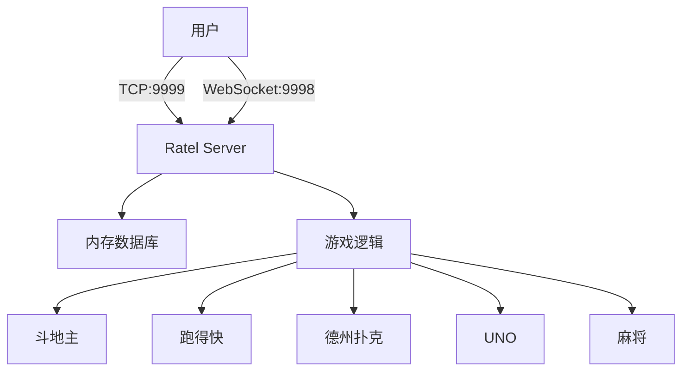

# Ratel游戏服务器 Docker 部署指南

## 项目概述

Ratel是一个命令行在线多人棋牌游戏服务器，支持斗地主、跑得快、德州扑克等多种游戏模式。本文档提供了使用Docker和Docker Compose进行部署的完整方案。

### 系统架构



## 快速开始

### 前置要求

- Docker 20.10+
- Docker Compose 2.0+ 或 Docker 20.10+（内置 compose 插件）
- Git

> 注意：新版 Docker 已内置 compose 插件，可以使用 `docker compose` 命令。Makefile 会自动检测并使用可用的命令。

### 快速部署

1. 克隆项目
```bash
git clone https://github.com/ratel-online/server.git
cd server
```

2. 构建并启动服务
```bash
docker-compose up -d
```

3. 查看服务状态
```bash
docker-compose ps
docker-compose logs -f
```

4. 停止服务
```bash
docker-compose down
```

## 部署方案详解

### 1. Dockerfile 说明

项目使用多阶段构建优化镜像大小：

- **构建阶段**：使用 `golang:1.17-alpine` 作为基础镜像编译Go应用
- **运行阶段**：使用 `alpine:latest` 作为最终镜像，只包含必要的运行时依赖

主要特性：
- 多阶段构建减小镜像体积
- 使用非root用户运行提高安全性
- 配置健康检查确保服务可用性
- 设置时区为 Asia/Shanghai

### 2. Docker Compose 配置

提供了两个配置文件：

#### docker-compose.yaml（开发环境）
- 本地构建镜像
- 资源限制较宽松
- 适合开发测试使用

#### docker-compose.prod.yaml（生产环境）
- 使用预构建镜像
- 严格的资源限制
- 包含Nginx反向代理
- 日志持久化配置

### 3. 端口说明

| 端口 | 协议 | 用途 |
|------|------|------|
| 9998 | WebSocket | 浏览器客户端连接 |
| 9999 | TCP | 命令行客户端连接 |
| 80 | HTTP | Nginx反向代理（可选） |
| 443 | HTTPS | Nginx SSL（可选） |

## 生产环境部署

### 1. 构建生产镜像

```bash
# 构建镜像
docker build -t ratel-server:latest .

# 或者使用特定版本标签
docker build -t ratel-server:v1.0.0 .
```

### 2. 使用生产配置启动

```bash
# 使用生产环境配置
docker-compose -f docker-compose.prod.yaml up -d
```

### 3. 配置SSL证书（可选）

如果需要HTTPS支持：

```bash
# 创建SSL证书目录
mkdir -p nginx/ssl

# 将证书文件复制到目录
cp your-cert.pem nginx/ssl/cert.pem
cp your-key.pem nginx/ssl/key.pem

# 修改nginx/nginx.conf，启用HTTPS配置
# 然后重启nginx服务
docker-compose -f docker-compose.prod.yaml restart nginx
```

### 4. 日志管理

日志文件会保存在 `./logs` 目录：

```bash
# 查看实时日志
docker-compose -f docker-compose.prod.yaml logs -f ratel-server

# 查看最近100行日志
docker-compose -f docker-compose.prod.yaml logs --tail=100 ratel-server
```

## 性能优化

### 1. 资源配置

根据服务器配置调整资源限制：

```yaml
deploy:
  resources:
    limits:
      cpus: '4'      # 最大CPU核心数
      memory: 1G     # 最大内存
    reservations:
      cpus: '1'      # 保留CPU核心数
      memory: 256M   # 保留内存
```

### 2. 并发连接优化

对于高并发场景，可以调整系统参数：

```bash
# 增加文件描述符限制
echo "* soft nofile 65535" >> /etc/security/limits.conf
echo "* hard nofile 65535" >> /etc/security/limits.conf

# 优化TCP参数
sysctl -w net.core.somaxconn=65535
sysctl -w net.ipv4.tcp_max_syn_backlog=65535
```

## 监控和维护

### 1. 健康检查

服务配置了自动健康检查：

```bash
# 手动检查服务健康状态
docker-compose -f docker-compose.prod.yaml exec ratel-server nc -z localhost 9998
```

### 2. 备份策略

由于游戏数据存储在内存中，重启会丢失数据。如需持久化，建议：

1. 定期导出游戏状态（需要修改代码支持）
2. 使用外部数据库存储关键数据
3. 实现分布式缓存方案

### 3. 更新部署

```bash
# 拉取最新代码
git pull

# 重新构建镜像
docker-compose -f docker-compose.prod.yaml build

# 滚动更新
docker-compose -f docker-compose.prod.yaml up -d --no-deps --build ratel-server
```

## 故障排查

### 常见问题

1. **端口被占用**
```bash
# 检查端口占用
netstat -tlnp | grep -E '9998|9999'

# 修改docker-compose.yaml中的端口映射
ports:
  - "19998:9998"  # 使用其他端口
  - "19999:9999"
```

2. **容器无法启动**
```bash
# 查看容器日志
docker-compose logs ratel-server

# 检查容器状态
docker ps -a
```

3. **连接超时**
- 检查防火墙规则
- 确认Docker网络配置
- 验证健康检查状态

### 调试模式

```bash
# 进入容器调试
docker-compose exec ratel-server sh

# 查看进程状态
ps aux

# 测试网络连接
nc -zv localhost 9998
nc -zv localhost 9999
```

## 安全建议

1. **网络隔离**
   - 使用专用网络避免容器间不必要的通信
   - 限制外部访问，只暴露必要端口

2. **用户权限**
   - 容器内使用非root用户运行
   - 限制文件系统权限

3. **资源限制**
   - 设置CPU和内存限制防止资源耗尽
   - 配置日志轮转避免磁盘占满

4. **定期更新**
   - 及时更新基础镜像
   - 关注安全公告

## 扩展部署

### 1. Kubernetes 部署

可以基于Docker镜像创建Kubernetes部署：

```yaml
apiVersion: apps/v1
kind: Deployment
metadata:
  name: ratel-server
spec:
  replicas: 3
  selector:
    matchLabels:
      app: ratel-server
  template:
    metadata:
      labels:
        app: ratel-server
    spec:
      containers:
      - name: ratel-server
        image: ratel-server:latest
        ports:
        - containerPort: 9998
        - containerPort: 9999
```

### 2. Docker Swarm 部署

```bash
# 初始化Swarm
docker swarm init

# 部署服务栈
docker stack deploy -c docker-compose.prod.yaml ratel
```

## 总结

本部署方案提供了完整的Docker化部署流程，包括：

- ✅ 多阶段构建优化镜像大小
- ✅ 开发和生产环境配置分离
- ✅ 健康检查和自动重启
- ✅ 日志管理和资源限制
- ✅ 可选的Nginx反向代理
- ✅ 安全最佳实践

通过Docker部署可以实现：
- 快速部署和迁移
- 环境一致性保证
- 便捷的扩容和管理
- 与CI/CD流程集成

如有问题或需要进一步的帮助，请参考项目的GitHub Issues或联系开发团队。 